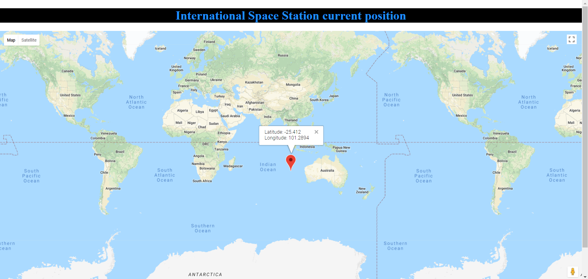
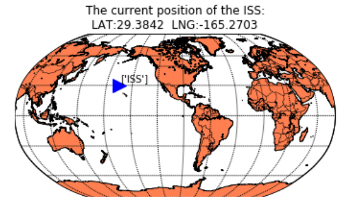

# ISS-Location-Plotter
Plots the location of the International Space Station(ISS).
There are two implementations: - 
  1. Javascript implementation: The location is plotted using Google maps.
  2. Python implementation: The location is plotted using matplot plotting libraries.
  
## Note
In order to use the Google maps implementation, users must obtain an API key for the google maps and place in the source
```javascript
<script async defer src="https://maps.googleapis.com/maps/api/js?key=apikey&callback=initMap">
```

### output
__Google maps implementation__


__Python implementation__


